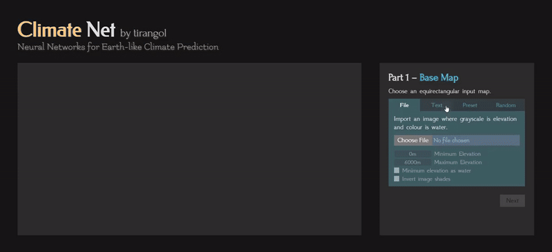
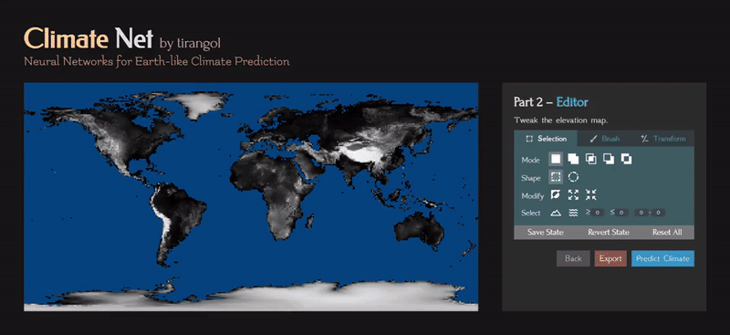

<p align="center">

</p>

# Climate-Net

A worldbuilding app that uses neural networks to predict the climate of Earth-like planets, intended as a fast, high-resolution tool for editing elevation maps and realistic climates. In this context, "Earth-like" means to match modern-era Earth in every property except for the elevation map. The only inputs required are elevation and land/water boundaries; the outputs include monthly temperature and precipitation and climate classifications.

An older 2023 version of the project [exists](https://github.com/tirangol/Projects/tree/main/climate%20net). This version upgrades from that in pretty much every way, from more input customization, more powerful map editing, more visualizations, downloading graphics, direct support for NPY (at the cost of TIFF files, which were not working), and faster inference times (~5 seconds). I also felt the growing project size warranted a separate repository.

This project is inspired by the extremely intricate worldbuilding tutorials of [Worldbuilding Pasta](https://worldbuildingpasta.blogspot.com/p/blog-page.html), [Artefixian](https://www.youtube.com/playlist?list=PLduA6tsl3gyiX9fFJHi9qqq4RWx-dIcxO), and [Madeline James Writes](https://www.youtube.com/playlist?list=PLmhjHG1F7VXkkH4fG_t3WuZaikiQRJaHJ); the tool essentially performs the majority of steps outlined in the tutorials the best of my ability, to hopefully decent results. 


## Instructions
 
If you want to run Climate Net without interacting with Python or your computer's command line, download everything in this repository and run `Climate Net.exe`. The EXE was painfully compiled from PyInstaller after many days of strange errors and crashes. It works on Windows 10, but I do not know if it will work on other operating systems.
 
If you want to run Climate Net using Python, this project used Python 3.10 with the following libraries:

- `numpy` 1.26.4
- `scipy` 1.14.1
- `onnxruntime` 1.20.1
- `pywebview` 5.3.2
- `flask` 3.0.3
- `torch` 2.4.1
- `torchvision` 0.19.1
- `netCDF4` 1.7.2
- `pillow` 11.0.0
- `matplotlib` 3.9.2
- `scikit-learn` 1.5.2
- `tqdm` 4.62.3
- `pandas` 2.2.3

Only the first five listed libraries are strictly necessary to run this project: the others were just for preprocessing.

To get started, run `gui.py` on Python, either via your IDE or the command-line interface. After some time, a GUI should automatically pop up. If something goes wrong, go into `gui.py` and erase every line that refers to `webview`, then uncomment `APP.run()`. If you run again, a regular Flask session should pop up in the command-line and print a local link for you to go to.

If you're only interested in running the frontend, download only the `static` and `template` folders. Go to `index.html` and comment out the backend imports and use the non-backend imports. Also, every `` tag has a part containing `src="{{ url_for('static', filename='something') )}}"`; replace this with `src="../something"`. In `index.js`, go to the function `predictClimate`, uncomment the "No backend" part and comment the "Backend" part.

If you're only interested in running the backend, `gui.py` contains the main function for making predictions. If you're interested in using the pytorch models directly instead of ONNX, you can use the following code:

```python
TEMPERATURE_NET = TemperatureNet()
PRECIPITATION_NET = PrecipitationNet()
TEMPERATURE_NET.load(...)  # Path to the directory containing temperature-net.pt
PRECIPITATION_NET.load(...)  # Path to the directory containing precipitation-net.pt

elevation = ...  # (180 x 360) float numpy array
land = ...  # (180 x 360) boolean numpy array
x = preprocess_inference(elevation, land)

temp, temp_avg, continentality, elevation_slope = TEMPERATURE_NET.predict(x)
prec, prec_sum = PRECIPITATION_NET.predict(x, temp)

# temp, prec are (12, 180, 360) numpy arrays
# the others are (1, 180, 360) numpy arrays
```


## Frontend

Users can upload images of elevation maps (equirectangular maps where colour is water and grayscale is shade) or NPY inputs, paste in 2D matrices of numbers (of the format `[[a, b, c, ...], ...]` or `[a, b, c, ... ; ...]`), select some presets, or generate random terrain maps.

<p align="center">

</p>

Using the brush editor, they can make selections, transformations, and changes to the elevation map using a brush; the functionality is not unlike an image editing program such as Photoshop.

<p align="center">

</p>

Upon completion, Climate Net generates visualizations of temperature, precipitation, climate classification system, individual pixel climate graphs, etc. for the given elevation map.

<p align="center">

</p>

## Backend

Climate Net runs on a Python Flask backend. The input is a $180 \times 360$ Numpy array, which is run through many image processing algorithms that make use of map projections, convolutions, and morphological image operations to approximate properties like continentality/oceanity, west/east coasts, land/water distances, elevation differences and rainshadow, the inter-tropical convergence zone (ITCZ), and ocean gyre temperatures.

The preprocessed result is fed into `ClimateNet`, which consists of `TemperatureNet` and `PrecipitationNet`, which are heavily-constrained neural networks. To be specific, `TemperatureNet` predicts an average temperature, continentality, elevation slope, and 12 offset values (that add up to 0), and predicts temperature by `temp[month] = avg_temp + offset[month] * continentality + elevation * elevation_slope`. The `PrecipitationNet` predicts an annual precipitation and monthly distribution, and predicts monthly precipitation by `prec[month] = prec_sum * softmax(prec_distribution)[month]`.

The models are lightweight enough for a CPU (<10K parameters in total) and decently quick. Some features include:

- Lipschitz linear layers, which constrain the derivative ([source](https://github.com/whitneychiu/lipmlp_pytorch/blob/main/models/lipmlp.py))
- Minimum/maximum bounds multiplied by sigmoids for most of the intermediate variables, to ensure predictions are physically plausible
- Skip connections, to prevent interactions between obviously unrelated variables
- Adding an additional Sobel loss ([source](https://github.com/chaddy1004/sobel-operator-pytorch/blob/master/model.py)), which was loss between the Sobel filter applied to the prediction and to the target. This additional term ensured smooth spatial transitions between nearby temperature/precipitation values and no strange bumps.
- Log-based loss for `PrecipitationNet`, $(\ln(y + 1) - \ln(t + 1))^4$ so that precipitation values in different orders of magnitude are weighted with differing levels of precision
- Some convolutional layers in the `PrecipitationNet`.


## Sources

Preset data for the [moon](https://svs.gsfc.nasa.gov/4720/) , [Mercury](https://astrogeology.usgs.gov/search/map/mercury_messenger_global_dem_665m), [Mars](https://astrogeology.usgs.gov/search/map/mars_mgs_mola_dem_463m), and Venus ([1](https://astrogeology.usgs.gov/search/map/venus_magellan_global_topography_4641m), [2](https://astrogeology.usgs.gov/search/map/venus_magellan_global_c3_mdir_colorized_topographic_mosaic_6600m)) are mostly from USA government websites. A lot of maps were H x 2H where the left and right H x H blocks were stretched, near-duplicate versions of the actual map, which was strange; they were also scaled to some unknown value, so I multiplied/divided them to roughly match actual minimums/maximums. There were two Venus elevation maps: a map with blanks, and a complete but colour-coded Venus elevation map with an unknown colour mapping. I fit a `HistGradientBoostingRegressor` between the coloured Venus's HSV to the elevation Venus map, and filled the blanks from there.

The data for Earth's elevation, temperature, and precipitation are provided on [WorldClim](https://www.worldclim.org/data/worldclim21.html). The model was also trained on climate simulation data for a retrograde-spinning Earth, which was processed using `netCDF4` on data from this [website](https://www.wdc-climate.de/ui/entry?acronym=DKRZ_LTA_110_ds00001) based on [this paper](https://esd.copernicus.org/articles/9/1191/2018/#section9). The retrograde data's resolution of $48 \times 96$ made it rather tricky to train alongside the $180 \times 360$ data.

Data for the shape of lakes and inland water bodies came from an asset in [G.Projector](https://www.giss.nasa.gov/tools/gprojector/).

Data for cities across the world came from the free version of [this site](https://simplemaps.com/data/world-cities). 

Icons come from random images found on Google search. Colour schemes are from matplotlib. Various Javascript libraries were used for handling PNG ([reimg.js](https://github.com/gillyb/reimg)), NPY ([npy-rw.js](https://gist.github.com/LingDong-/b24f172ba0888976143463a8801e2040)), and GIF ([GIFEncoder.js](https://github.com/antimatter15/jsgif)) files. I also used Ajax from jQuery to asynchronously send finished elevation maps to be processed.


## Issues and Improvement

`TemperatureNet` underpredicts temperature in oceanic west coasts (e.g. West/North Europe) and overpredicts temperature in temperate east coasts (e.g. China).

`PrecipitationNet` is generally a lot less accurate because it was too difficult for me to algorithmically follow many of the tutorial steps for generating most important features. In general, it vastly underpredicts coastal precipitation and equatorial coastal regions (e.g. Indonesia, Panama) and overpredicts desert/tropic transition zones (e.g. the Sahel). There are also some abrupt precipiation transitions that are very suspect.

Most of the future development time will probably be focused on improving the `PrecipitationNet` with better features.

The web part of the app has not been thoroughly tested, so there may be bugs. Also, it has only been tested in Chrome and Edge on Windows 10. If something doesn't display right... welp.
